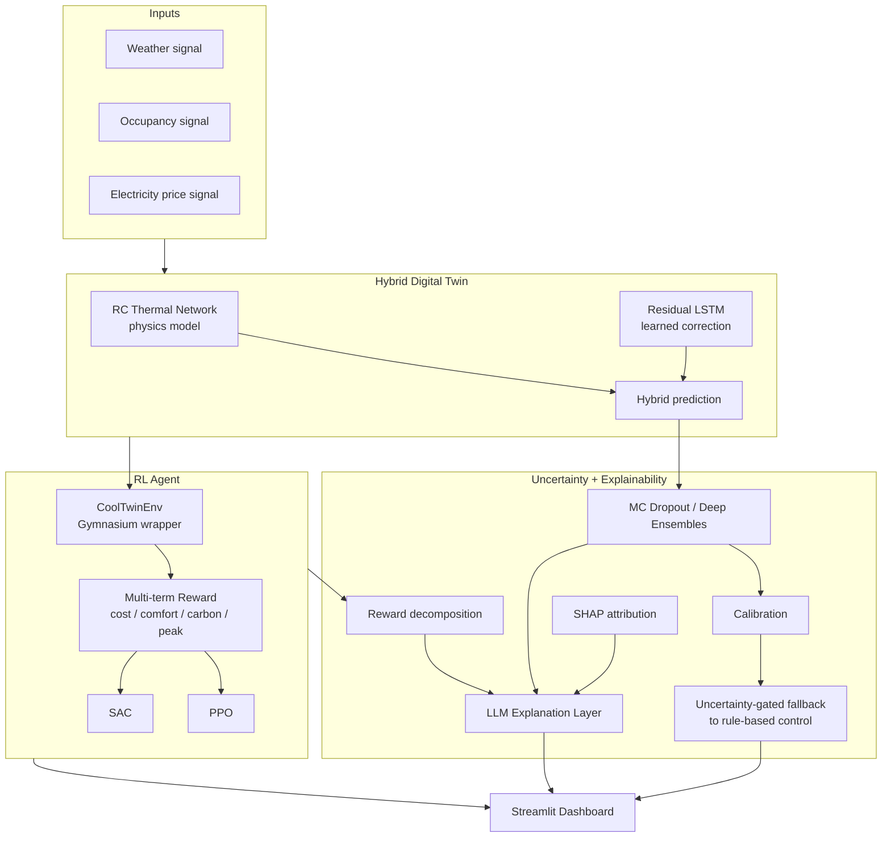

# CoolTwin

**An Explainable, Uncertainty-Aware Digital Twin Framework for Autonomous HVAC Scheduling**
using Hybrid AI, Reinforcement Learning, and Multi-Objective Optimization.

Built for the Schneider Electric Co-Creation Challenge 2026.

Team: Aryan Vatsal, Anmol Tibrewal, Josithaa Joseph — Vellore Institute of Technology
Guide: Dr. Athira K

---

## What this is

A single-zone HVAC controller that combines:

- **A hybrid digital twin**: a physics-based RC (resistor-capacitor) thermal network, corrected
  by a learned residual model (LSTM), so the twin is both interpretable and accurate.
- **A reinforcement learning agent** (PPO / SAC) trained inside the twin, optimizing a
  multi-term reward over energy cost, comfort, carbon emissions, and peak demand.
- **Uncertainty quantification** (MC Dropout, Deep Ensembles) so the agent knows when it
  doesn't know — and can fall back to conservative rule-based control.
- **Explainability** (reward decomposition, SHAP, an LLM explanation layer) so a
  non-technical building operator can ask "why did you do that?" and get a real answer.

## Why this scope

This project intentionally does **not** try to build a full industrial platform
(Kubernetes, Kafka, knowledge graphs, multi-agent orchestration, etc.) as a working
prototype. Those are documented as deliberate future work in
[`docs/future_work.md`](docs/future_work.md). The goal here is a small number of things
built *properly*, evaluated honestly, and explainable end-to-end — not a long list of
half-built integrations.

## Architecture



See [`docs/architecture.md`](docs/architecture.md) for the component-by-component
notes, and [`docs/methodology.md`](docs/methodology.md) for how and why each phase
was built the way it was.

## Status

- **Phase 1** (foundations) — repo scaffolding, baseline environment, RC thermal model. ✅
  The custom RC-network environment (`twin/env.py`) is the default for everything else
  in this repo — no EnergyPlus install required. Sinergym/EnergyPlus is now also wired
  in and verified working as an optional, higher-fidelity path (see
  `notebooks/00b_sinergym_baseline.py` for a real EnergyPlus-backed random-action run,
  and `docs/sinergym_setup.md` for setup — there's one non-obvious env var gotcha
  documented there). A first-pass validation of the 3R2C physics model against a real
  EnergyPlus trajectory (`notebooks/06_sinergym_validation.py`) found a genuinely bad
  fit (~11°C RMSE) — diagnosed, not hidden: the ground-truth signal used is itself the
  output of EnergyPlus's own closed control loop, not an independent forcing input.
  See `results/sinergym_validation.md` for the full diagnosis and the concrete next
  step to fix it.
- **Phase 2** (hybrid twin) — residual LSTM correction model, trained and evaluated
  against physics-only and pure-ML baselines. ✅
  Result on held-out synthetic test episodes: **hybrid RMSE 0.18°C** vs. physics-only
  0.42°C and pure-ML 0.21°C — see `notebooks/01_train_residual_lstm.py`.
- **Phase 3** (RL agent) — PPO and SAC trained on the twin with a configurable
  multi-objective reward (cost/comfort/carbon/peak), evaluated against rule-based,
  PID, and random baselines; Pareto front traced across 5 reward weightings. ✅
  Result (short training budget, 15k timesteps — see note below): **SAC beat the
  rule-based thermostat baseline on both energy use (205 vs 210 kWh) and reward**,
  with comparable comfort — see `notebooks/02_train_rl_agents.py` and `rl/pareto.py`.

  *Note on training budget*: the numbers above use a short (~3 min) training run so
  the pipeline is fast to iterate on and CI-friendly. The Pareto sweep's discomfort
  axis doesn't yet fully separate across weightings at this budget — increase
  `total_timesteps` in `rl/pareto.py` / `notebooks/02_train_rl_agents.py` (e.g. to
  200k+) for final results used in the report/pitch.
- **Phase 4** (uncertainty quantification) — MC Dropout and Deep Ensembles trained
  on the residual model, calibration measured via reliability diagrams + Expected
  Calibration Error (ECE), and an uncertainty-gated safety layer that falls back to
  rule-based control under high uncertainty. ✅
  Result: **both methods were meaningfully overconfident out of the box** (ECE 0.33
  MC Dropout, 0.45 Deep Ensemble — see `results/calibration_reliability_diagram.png`).
  Applying standard post-hoc variance scaling (fit on a validation split, evaluated
  on held-out test data) brought both down to near-perfect calibration (**ECE 0.009
  and 0.029**). The Deep Ensemble showed clearly higher sensitivity to distribution
  shift (3.1x std increase on an out-of-distribution "heatwave" episode, vs. MC
  Dropout's 1.3x) and was selected for the safety layer on that basis. The fallback
  triggered on 21% of steps in-distribution vs. 59% during the heatwave shock —
  see `notebooks/03_uncertainty_quantification.py`.
- **Phase 5** (explainability) — reward decomposition, SHAP feature attribution
  (both the residual model and the RL policy), and an LLM explanation layer with
  a deterministic template fallback (so it works offline / in CI without an API
  key) plus a small canned Q&A router. ✅
  See `results/reward_decomposition.png` for a 2-day evaluation episode — comfort
  penalty clearly dominates during two daytime heat peaks while other terms stay
  low, a genuinely interpretable pattern. SHAP correctly attributes the twin's
  correction at the worst-comfort step to `T_in_physics` and `T_out` from the most
  recent timesteps. Set `ANTHROPIC_API_KEY` to use the real LLM in
  `explainability/llm_explainer.py`; without it, a grounded template-based
  explanation is used automatically (same underlying numbers either way) — see
  `notebooks/04_explainability.py`.
- **Phase 6** (evaluation) — the definitive comparison table for the report/pitch:
  all controllers (random, rule-based, PID, single-objective PPO, multi-objective
  PPO, multi-objective SAC) evaluated on the same held-out episode, with comfort
  reported in actual °C-hours, peak demand % change vs. rule-based, and per-decision
  inference latency. ✅ See `results/final_evaluation_table.md`.

  **Key finding**: the single-objective (cost-only) PPO policy uses 84% less peak
  power and 92% less energy than the rule-based baseline — but at **~2.7x worse
  comfort violation** (255.7°C-hr vs. 86–95°C-hr for the multi-objective policies).
  This is the empirical demonstration of exactly the trade-off problem described in
  the abstract's problem statement: single-objective controllers sacrifice comfort
  for cost. See `notebooks/05_final_evaluation.py`.
- **Phase 7** (dashboard) — an interactive Streamlit dashboard (`dashboard/app.py`)
  tying every phase together: live twin fidelity (physics vs hybrid vs ground truth),
  the RL policy's decisions + reward decomposition over an episode, predictive
  uncertainty + safety-layer fallback events, a fast Pareto-front preview, and the
  natural-language Q&A layer (LLM or template). ✅
  All training in the dashboard uses a short, interactive-speed budget — clearly
  labeled in the UI as demo-quality, not the final report numbers (those come from
  the longer offline runs in `notebooks/02`, `03`, and `05`). Verified end-to-end
  with Streamlit's official `AppTest` framework (renders, chat Q&A, and the Pareto
  preview button all confirmed exception-free) — see `tests/test_dashboard.py`.

See [`docs/roadmap.md`](docs/roadmap.md) for the full build plan, and
[`docs/pitch_prep.md`](docs/pitch_prep.md) for the pitch story arc, key numbers,
and prepared answers for the hard questions.

## Quickstart

```bash
git clone <your-repo-url>
cd CoolTwin
python -m venv .venv && source .venv/bin/activate
pip install -r requirements.txt

# Run the baseline: random-action agent on the RC-network zone
python notebooks/00_baseline_random_agent.py

# Train the hybrid twin's residual model and see the RMSE comparison table
python notebooks/01_train_residual_lstm.py

# Train PPO + SAC, compare against rule-based/PID/random baselines
python notebooks/02_train_rl_agents.py

# Trace the Pareto front across reward weightings (takes a few minutes)
python rl/pareto.py

# Train MC Dropout + Deep Ensemble, calibrate, demo the safety layer
python notebooks/03_uncertainty_quantification.py

# Reward decomposition, SHAP attribution, LLM/template explanations, Q&A demo
python notebooks/04_explainability.py

# Final comparison table across all controllers (the headline report table)
python notebooks/05_final_evaluation.py

# Launch the interactive dashboard
streamlit run dashboard/app.py

# Run tests
pytest tests/
```

For the LLM explanation layer, set your Anthropic API key first (optional --
falls back to a template-based explainer automatically if unset):
```bash
export ANTHROPIC_API_KEY=sk-ant-...
```

Sinergym / EnergyPlus is optional and gives a higher-fidelity, real EnergyPlus-backed
alternative to the RC-network environment above — **not required** for anything else
in this repo. See [`docs/sinergym_setup.md`](docs/sinergym_setup.md) for setup, then:
```bash
# Random-action sanity check on a real EnergyPlus scenario
python notebooks/00b_sinergym_baseline.py

# Fit the 3R2C model against a real EnergyPlus trajectory (see the honest
# result and diagnosis in results/sinergym_validation.md)
python notebooks/06_sinergym_validation.py
```

## Repo structure

```
CoolTwin/
├── twin/              # physics model, residual ML model, hybrid twin, gym env
├── rl/                # RL training (PPO/SAC), reward function, Pareto front
├── uncertainty/        # MC Dropout, ensembles, calibration
├── explainability/     # reward decomposition, SHAP, LLM explanation layer
├── dashboard/           # Streamlit app
├── evaluation/          # baselines, metrics
├── notebooks/           # exploratory scripts/notebooks
├── results/             # generated plots, tables (gitignored except .gitkeep)
├── docs/                 # architecture, roadmap, methodology, future work
└── tests/                 # unit tests
```

## License

MIT — see `LICENSE`.
