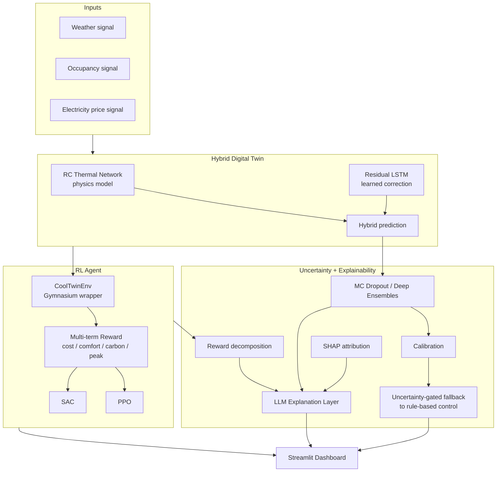

# CoolTwin — Architecture

## System overview (current scope, Phase 1–7)

## Component notes

| Component | Why it exists | Notes |
|---|---|---|
| RC Thermal Network | Interpretable physics prior; cheap to simulate | See `twin/rc_model.py`. 3R2C, fit via least-squares (`fit_rc_params`) |
| Residual LSTM | Corrects systematic error in the physics model | Phase 2. Trained on RC-prediction-error, not raw temperature |
| CoolTwinEnv | Standard Gym interface so any RL library works unmodified | `twin/env.py`. Swaps physics-only twin for hybrid twin without interface changes |
| Multi-term reward | Encodes the actual multi-objective tradeoff from the project abstract | `rl/reward.py` (Phase 3). Weights explored to build the Pareto front |
| PPO / SAC | Two on/off-policy algorithms for a fair comparison | via `stable-baselines3`, not reimplemented |
| MC Dropout / Ensembles | Two independent uncertainty estimation methods | Phase 4 |
| Uncertainty-gated fallback | The "safety layer" — falls back to rule-based control under high uncertainty | Cheap, effective, demoable |
| Reward decomposition | Cheapest, most concrete form of explainability — already computed | Phase 5 |
| SHAP | Feature attribution for twin predictions / policy actions | Phase 5 |
| LLM Explanation Layer | Turns structured context (state + decomposition + SHAP + uncertainty) into natural language | One well-prompted call, not a multi-agent system |

## What's explicitly out of scope for the prototype

See [`future_work.md`](future_work.md) for the full list (knowledge graph, multi-agent
orchestration, Kubernetes/Kafka, full cloud deployment, RAG over documents, etc.) and the
reasoning for deferring each.
